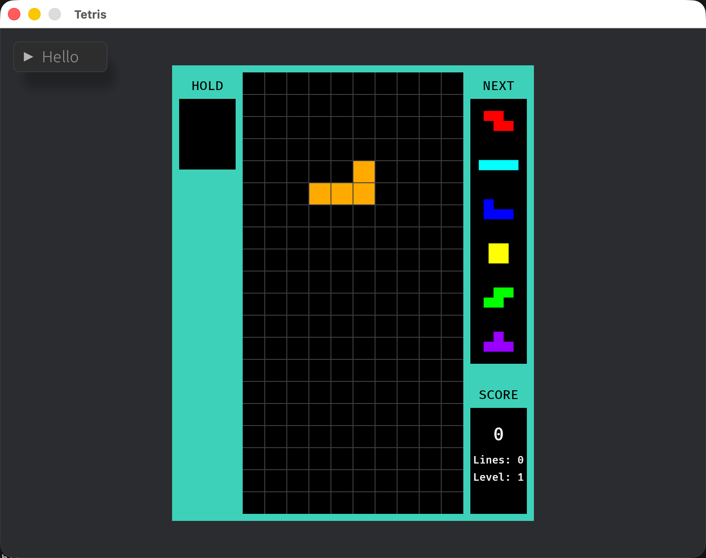

# bevy-tetris

A Tetris game built with the Bevy 0.15.1 game engine, following Guideline Tetris rules.



## Features

- **SRS Wall Kicks**: Full Super Rotation System with kick tables for all piece types
- **7-Bag Randomizer**: Guideline-compliant piece randomization
- **Scoring**: Line clears (100/300/500/800), hard drop (2pts/cell), soft drop (1pt/cell)
- **Line Clearing**: Automatic detection and clearing with gravity
- **Hard Drop / Soft Drop**: Fast drop and accelerated drop
- **Next Piece Preview**: Shows the next 6 upcoming pieces
- **Game Over & Restart**: Detection when blocks can't spawn, press Enter to restart
- **Hold Piece**: Press C to swap current piece with held piece
- **Level System**: Speed increases every 10 lines cleared
- **Ghost Piece**: Translucent preview showing where the active piece will land
- **Lock Delay**: 0.5s grace period to adjust a piece after it touches the ground (resets on move/rotate, max 15 resets, cancels if space opens below)
- **Pause**: Press P to pause/resume the game
- **Score Display**: Real-time score, lines cleared, and level in the side panel
- **Debug UI**: Board state visualization using egui

## Requirements

- Rust (edition 2021)

## Getting Started

```bash
git clone <repository-url>
cd bevy-tetris
cargo run --release
```

## Building & Packaging

**WASM（浏览器）**
```bash
trunk build --release
zip -r bevy-tetris-wasm.zip dist/
```

**macOS x86_64**
```bash
rustup target add x86_64-apple-darwin
cargo build --release --target x86_64-apple-darwin
tar -czf bevy-tetris-macos-x86_64.tar.gz -C target/x86_64-apple-darwin/release bevy-tetris
```

**macOS aarch64 (Apple Silicon)**
```bash
rustup target add aarch64-apple-darwin
cargo build --release --target aarch64-apple-darwin
tar -czf bevy-tetris-macos-aarch64.tar.gz -C target/aarch64-apple-darwin/release bevy-tetris
```

**Linux / Windows**: 交叉编译依赖复杂，推荐通过 GitHub Actions 自动构建。推送 `v*` tag 即可触发全平台打包并生成 Release：

```bash
git tag v1.0.0
git push origin v1.0.0
```

## Controls

| Key | Action |
|-----|--------|
| ← → | Move block left/right |
| ↑ | Hard drop |
| ↓ | Soft drop |
| Q | Rotate counter-clockwise |
| E | Rotate clockwise |
| C | Hold piece (swap with held) |
| P | Pause / Resume |
| Enter | Restart (on game over) |
| Space | Toggle debug overlay (with bevy_dev_tools) |

## Game Rules

- **Board**: 10 × 20
- **Pieces**: I, O, T, S, Z, J, L
- **Rotation**: SRS with wall kicks
- **Randomizer**: 7-bag (all 7 pieces before reshuffling)
- **Drop Speed**: Level-based gravity (starts at 1s/row, increases every 10 lines), 0.05s/row soft, 0.01s/row hard
- **Lock Delay**: 0.5s after touching ground, resets on move/rotate (max 15), cancels if space opens below, hard drop bypasses

## Project Structure

```
src/
├── main.rs                # App setup, system registration, egui debug UI
├── board.rs               # Board coordinate conversion, collision detection
├── movement.rs            # Horizontal movement system
├── rotation.rs            # SRS rotation with wall kicks
├── drop.rs                # Drop logic, lock delay, block placement
├── line_clear.rs          # Line detection, scoring, row shifting
├── ghost.rs               # Ghost piece preview with change tracking
├── hold.rs                # Hold piece swap and preview rendering
├── game_state.rs          # Score display, pause, game over, restart
├── tetromino.rs           # Block types, rotation states, dot arrays
├── spawn_block_system.rs  # Block spawning, 7-bag randomizer, next preview
├── common_component.rs    # Shared components and resources
└── background.rs          # Background, grid, score panel rendering
```

## Technical Details

- **Engine**: Bevy 0.15.1
- **UI**: bevy_egui 0.32.0
- **Randomization**: rand 0.8.5
- **Coordinate System**: 25×25 pixel blocks, centered origin (800×600 window)

## Planned Features

- High score persistence

## License

[Add your license here]
